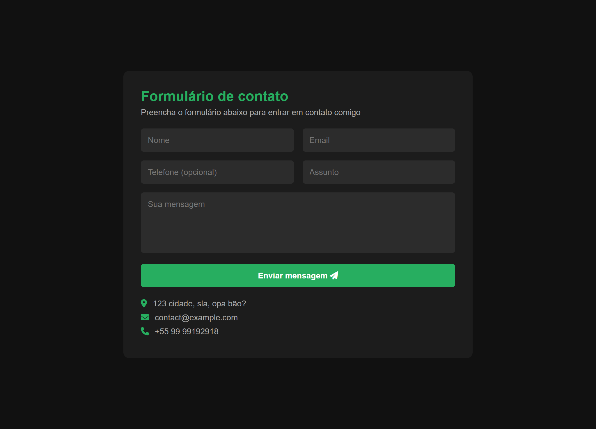

<h1 align="center">📬 FORMULÁRIO DE CONTATO 📬</h1>

###



<h4 align="center"><a href="https://joao-enrique.github.io/formulario-de-contato/
">Confira o projeto aqui</a></h4>

👾 Bem-vindo ao **Formulário de Contato** — uma aplicação simples e funcional para facilitar a comunicação entre usuários e você. 🚀  

###

<h2 align="left">🕹️ Funcionalidades</h2>

###
- ✅ Campos de nome, e-mail e mensagem  
- ✅ Validação de campos obrigatórios  
- ✅ Feedback visual para preenchimento correto ou incorreto  
- ✅ Design moderno e responsivo  

###

<h2 align="left">🧠 Como funciona?</h2>

###
1. O usuário preenche os campos obrigatórios (nome, e-mail, mensagem).  
2. Clique em **Enviar** para enviar a mensagem.  
3. O formulário valida os dados e exibe alertas se houver erros.  
4. Mensagem enviada com sucesso ou notificação de erro.  

Simples, direto e funcional 🎨  

###

<h1 align="left">💾 Tecnologias utilizadas</h1>

###
<div align="left">
  
  
  
  
  
</div>

###

<h1 align="left">🧪 Como rodar?</h1>

###
<p align="left">1. Faça o clone do projeto:</p>

```bash

https://github.com/joao-enrique/formulario-de-contato.git

```

<p align="left">2. Abra o <code>index.html</code> em seu navegador.</p>
<h1 align="left">👨‍💻 Estrutura</h1>

📁 formulario-contato<br>
├── index.html # Estrutura principal do formulário<br>
├── style.css # Visual moderno e responsivo<br>
├── script.js # Validação dos campos<br>
└── README.md # Você está aqui!

<h1 align="left">🔮 Futuras melhorias</h1>

Integração com e-mail real 💌

Mensagens automáticas de resposta 🤖

Temas claros e escuros 🌙☀️

Feedback animado para erros ou sucesso 🎨

<h1 align="left">📬 Contato</h1> <p align="left">Feito com ❤️ por João Enrique.</p> <div align="left"> <a href="https://www.instagram.com/joao__dev/" target="_blank">  </a> <a href="https://www.linkedin.com/in/joao-enrique-dev/" target="_blank">  </a> <a href="https://www.youtube.com/@joao__dev" target="_blank">  </a> </div>

> “Facilite a comunicação com seus usuários de forma simples e moderna.” – Contato Web